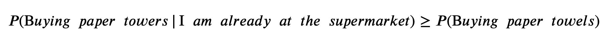
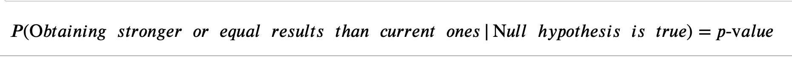
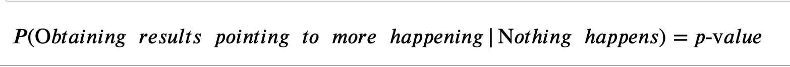

+++
title = "Des-p-value-cito"
date = 2018-09-13T20:06:21-07:00
draft = false

# Authors. Comma separated list, e.g. `["Bob Smith", "David Jones"]`.
authors = []

# Tags and categories
# For example, use `tags = []` for no tags, or the form `tags = ["A Tag", "Another Tag"]` for one or more tags.
tags = ["Statistics", "p-value", "hypothesis"]
categories = []

# Projects (optional).
#   Associate this post with one or more of your projects.
#   Simply enter your project's folder or file name without extension.
#   E.g. `projects = ["deep-learning"]` references
#   `content/project/deep-learning/index.md`.
#   Otherwise, set `projects = []`.
# projects = [""internal-project""]

# Featured image
# To use, add an image named `featured.jpg/png` to your page's folder.
[image]
  # Caption (optional)
  caption = "[source](https://www.dummies.com/education/math/statistics/how-to-determine-a-p-value-when-testing-a-null-hypothesis/)"

  # Focal point (optional)
  # Options: Smart, Center, TopLeft, Top, TopRight, Left, Right, BottomLeft, Bottom, BottomRight
  focal_point = " "
+++
  A simple and easy to follow explanation on the definition and function of a p-value. <!--more-->
     

   
### P-ardon Me?
Despacito in Spanish means “slowly” which is exactly how this article attempts to explain this statistics term. 

We are all aware of this little letter’s place in the English Alphabet (the 16th position) but where exactly does it belong in statistics? 

### The Analogy

Imagine you are walking down an aisle in the supermarket. You are trying to decide if you need to pick up dish soap. You get to the shelf and check the price. If it’s too expensive you decide to forgo this necessity (maybe you don’t even need it, how much do you have left at home?).  The higher the price of dish soap, the less likely you are to decide you need it. When dish soap is a lower price, there’s a greater chance that you will decide that you need it and subsequently purchase it. 

In this example, **price** is an analogy for a **p-value**. 

### American History – P:  The Ground Work

For any scientific experiment, there is a specific method that needs to be followed in order to ensure an unbiased and reliable conclusion. 

It starts with a question: 

**_“Do I need dish soap?”_**

This is called a *Hypothesis*. 

In scientific testing there are only ever 2 outcomes to a question:  

1. Everything stays the same.
2. Something interesting happens. 

Both these outcomes have proper names so allow me to elaborate: 

Meet the *Null Hypothesis* (or “the null”) – this is the default, starter value. It is outcome, where everything remains unchanged. 

    E.g. You don't need dish soap. 

And this is the *Alternate Hypothesis* – this is the opposite of the null, something has happened or something we think will happen. 

    E.g. You need dish soap.

When we prove the alternate hypothesis is correct and “true”, we say we are *"rejecting the null hypothesis"*. 

    E.g. You purchase the dish soap.

### Terms and Conditionals 

What does this have to do with p-value?  

To make matters simple - the p value is a conditional probability and in true probability form, cannot be negative or larger than 1. 

I am going to explain conditional probability with a quick example.

    Let’s say you want to buy paper towels for the kitchen. 
    The probability of going out and buying paper towels is going 
    to have a different value than if you are already at 
    the supermarket.
    For instance, on the weekend I am not as keen on 
    leaving my house simply to get paper towels, however the
    chance of me buying them given that I am already
    at the store is much higher. 

in this case:

  

*( “|”  can be replaced with the words “conditional that” or "given that")* 

The p value is therefore a probability, conditional on the assumption that our null hypothesis is true. 

### Tell me what it is already! 

So now we know it is conditional on our null being right, but what is it calculating exactly? 

Good question – It is the probability of getting results stronger than or equal to the current ones we have, given that our null hypothesis (the event where nothing happens) is true. 

This can be shown by:

Or less formally: 

In plain English this is like saying "the probability of getting results that differ from our current results, given that everything should stay the same". 

### To "p" or not to "p"? 

How do I use it?

* The lower the p value - the more evidence we have against the null hypothesis and therefore the more likely we can reject it.
This means our test is more reliable and has a stronger argument to support our alternate hypothesis. 

* The higher the p value – the less concrete our alternate hypothesis is; therefore, the ability to form a significant conclusion goes down. 

### P-icking up the P-eices 

Going back to our previous example, let’s assume the maximum price for dish soap is $100.00 (similar to how the maximum possible probability is 100%). 

If the price of dish soap is $78.65, are we more likely to buy it, or forgo the purchase (and raid our parents’ cupboards)?

-	In this case, we will likely not purchase the dish soap. Therefore, we are unable to say that something interesting happened due to the price being too high.

This is like saying - we cannot reject our null hypothesis, since the p value was too large. 

What if instead the dish soap was $2.99?

-	Here there is a higher chance that we will buy the dish soap, and therefore that something interesting would happen. 

In this case, we are more likely to reject our null hypothesis given a smaller price (p- value). 

### From A to P

As with most tests and experiments, there is a critical number that is given as a guideline separating the regions in which a person decides where they are comfortable rejecting or accepting the null hypothesis.  We call this **alpha**! 

If our p value is less than alpha – we can say with confidence that something interesting happened! 

If our p value is greater than alpha – no conclusions can be made to our question and we therefore accept the null.

### Easy-P-easy!

From now on if somebody asks you if you are having fun learning about Data Science, you will be able to tell them that the p value to that question is low! 

##### References: 

Dorey, F. (2010). In Brief: The P Value: What it is and What Does it Tell you? Clinical Orthopaedic and Related Research. 468(8): 2297–2298. doi:  10.1007/s11999-010-1402-9

Hung, T.Q (2016, March 21). Key to statistical result interpretation: P-value in plain English. Retrieved from https://www.students4bestevidence.net/p-value-in-plain-english-2/
