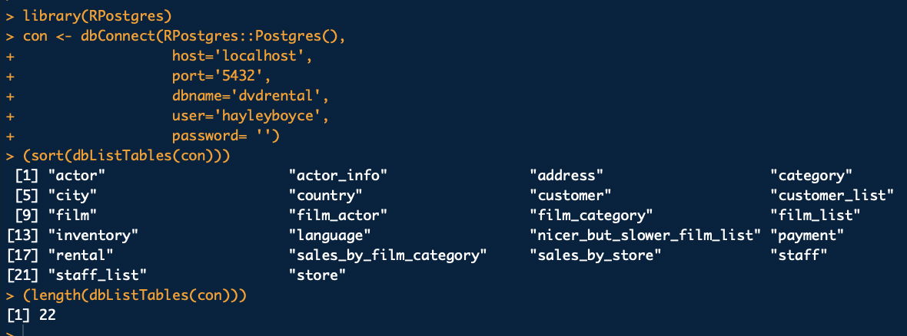

+++
title = "A Post About Importing Data into Python and R, Post Being in Postgres"
date = 2019-07-20T20:06:21-07:00
draft = false

# Authors. Comma separated list, e.g. `["Bob Smith", "David Jones"]`.
authors = []

# Tags and categories
# For example, use `tags = []` for no tags, or the form `tags = ["A Tag", "Another Tag"]` for one or more tags.
tags = ["Postgres", "python", "R", "Docker"]
categories = []

# Projects (optional).
#   Associate this post with one or more of your projects.
#   Simply enter your project's folder or file name without extension.
#   E.g. `projects = ["deep-learning"]` references
#   `content/project/deep-learning/index.md`.
#   Otherwise, set `projects = []`.
# projects = [""internal-project""]

# Featured image
# To use, add an image named `featured.jpg/png` to your page's folder.
[image]
  # Caption (optional)
  caption = ""

  # Focal point (optional)
  # Options: Smart, Center, TopLeft, Top, TopRight, Left, Right, BottomLeft, Bottom, BottomRight
  focal_point = "Center"
+++
How to bring in a Postgres database into a Python or R workspace. <!--more-->
     
     
### Motivation for this post

I recently explored data that was stored using Postgres. Because time was limited for this particular project and because I enjoy finding and visualizing insights simultaneously, I wanted to do my queries directly in the language I would be conducting EDA. 

Finding that there were limited resources that explained this process, I thought I would inform others of the way that I went about it. 


### R - Using library `RPostgres`

Using this library to make a connection is simple and easy. Be aware that some queries or commands and loading certain tables could take longer depending on the size of each table. 

Download the `RPostgres` library first from CRAN using: 

``` 
install.packages("RPostgres")

``` 
Then load it in your file:

``` 
library(RPostgres)

```
      
Next we connect to our local server: 

```
con <- dbConnect(RPostgres::Postgres()29-
      host='localhost',
      port='5432',
      dbname='database_name_goes_here',
      user='deployer_name_goes_here',
      password= 'if_applicable_add_psswd')
      

```
Running on your local, your `host` and `port` will stay the same, but you will have to use the database you are using with your user id and password. 

_**Note:**_    
If you are running this inside a Docker container, you will need to change the host from `localhost` to 

``` 
`host='host.docker.internal'`

```

Otherwise, it will not be able to establish a connection. 

**Example**   
Using the [dvdrental database](http://www.postgresqltutorial.com/postgresql-sample-database/) - which you can download [here](http://www.postgresqltutorial.com/wp-content/uploads/2019/05/dvdrental.zip), my execution looked like this:




You can then load the data from each table using the function `dbReadTable()`

```
assign_table_name <- dbReadTable(con, "Postgres_table_name")

```


Don't forget to close the connection when you are done importing the tables:

``` 
dbDisconnect(con)
```

And that's it for R folks! Easy right?


### Python- Using Module `psycopg2` and `pandas` 

Let's now covert an Elephant into a Snake. 
I am going to be working in a Jupyter Notebook to execute this for convenience. 

install psycopg2 and pandas on your terminal with the following command: 

**pip**
```
pip install psycopg2
pip install pandas
```

**conda**

```
conda install -c anaconda psycopg2
conda install pandas 
```

Next, in your python script or your Jupyter notebook, you will want to import both these packages 
```
import psycopg2 as pg
import pandas as pd

```
Now that we have the tools to make a connection, let's go ahead and do that using the function `connect()` 

The code will look similar to this: 

```
connection = pg.connect("dbname=insert-database-name-here user=user-name host=localhost port=5432")

```
_Fun Fact_ 
If you are doing this outside a docker container and on your local, `host` and `port` already default to `localhost` and `5432` respectively. 


If you want to have a look at the names of all the tables this code will create a cursor object and then will list them. 

```
cursor = connection.cursor()
cursor.execute("select relname from pg_class where relkind='r' and relname !~ '^(pg_|sql_)';")
table_names = cursor.fetchall()
for i in table_names:
    print(i[0])
    
```

This isn't needed to import and begin wrangling in Pandas but it helps to see the tables you have available in the Database.  

To start exploring in python using pandas, you can do so by saving each table as a variable like so: 

```
actors = pd.read_sql("SELECT * FROM insert-table-name-here", connection)
```

And now you can begin wrangling using python commands! 

The example using the `dvdrental` database from earlier looked like this:


