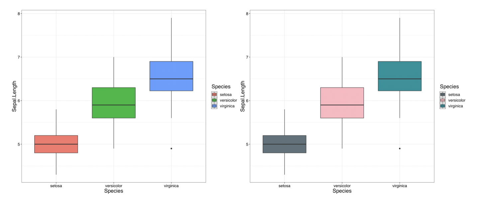
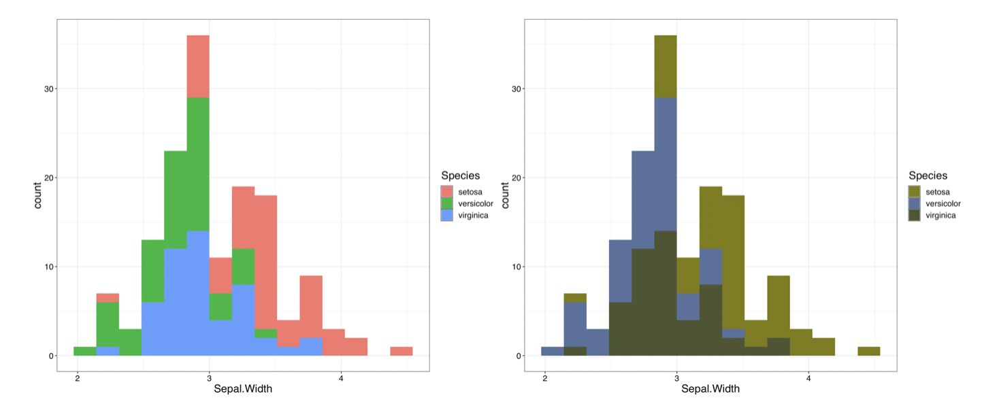
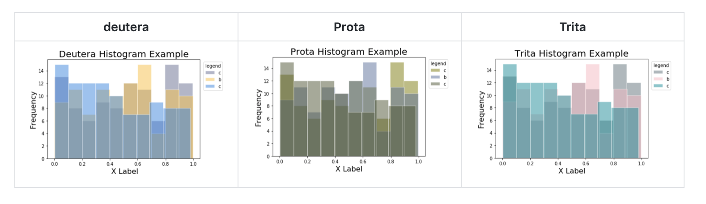

+++
title = "ColourblindR & Colourblind8"
date = 2019-03-01
draft = false

#Tags: can be used for filtering projects.

#Example: tags = ["machine-learning", "deep-learning"]
#Project summary to display on homepage.

summary = "A Python and R package facilitating colourblind friendly visualizations"

#Slides (optional).
#Associate this page with Markdown slides.
#Simply enter your slide deck's filename without extension.
#E.g. slides = "example-slides" references
#content/slides/example-slides.md.
#Otherwise, set slides = "".
slides = ""

#Optional external URL for project (replaces project detail page).
external_link = ""

#Links (optional).

#url_pdf = "" url_code = "" url_dataset = "" url_slides = "" url_video = "" url_poster = ""

url_code = "https://github.com/hfboyce/ColourblindR"

#Custom links (optional).

#Uncomment line below to enable. For multiple links, use the form [{...}, {...}, {...}].
#url_custom = [{icon_pack = "fab", icon="twitter", name="Follow", url = "https://twitter.com"}]

#Featured image
#To use, add an image named featured.jpg/png to your page's folder.

[image]

#Caption (optional)
caption = ""

#Focal point (optional)
#Options: Smart, Center, TopLeft, Top, TopRight, Left, Right, BottomLeft, Bottom, BottomRight

focal_point = "Center"
+++

Colourblindness, also known as colour vision deficiency, is a condition that affects individuals how they perceive colours. Colourblindness affects 1 in every 12 men and 1 in every 200 women globally [[source](www.colourblindawareness.org)]. This fact inspired my team and I to create a package that accommodates people without knowledge about this condition to make their graphs accessible to all. The objective of these packages is to enhance data visualization by implementing proper colours so that the graphs are perceived correctly by all readers as intended.

  
<strong> Fig 1: From the ColourblindR package, applying theme_trita() </strong>

  
<strong> Fig 2: From the ColourblindR package, applying theme_prota() </strong>

  
<strong> Fig 4: From the Colourblind8 package, using method plot_histogram() </strong>

The packages are available for installation from the repository links listed below:

* [R Package Repository](https://github.com/hfboyce/ColourblindR)  
* [Python Package Repository](https://github.com/hfboyce/Colourblind8)  

The repository includes methods and implemention examples. 

