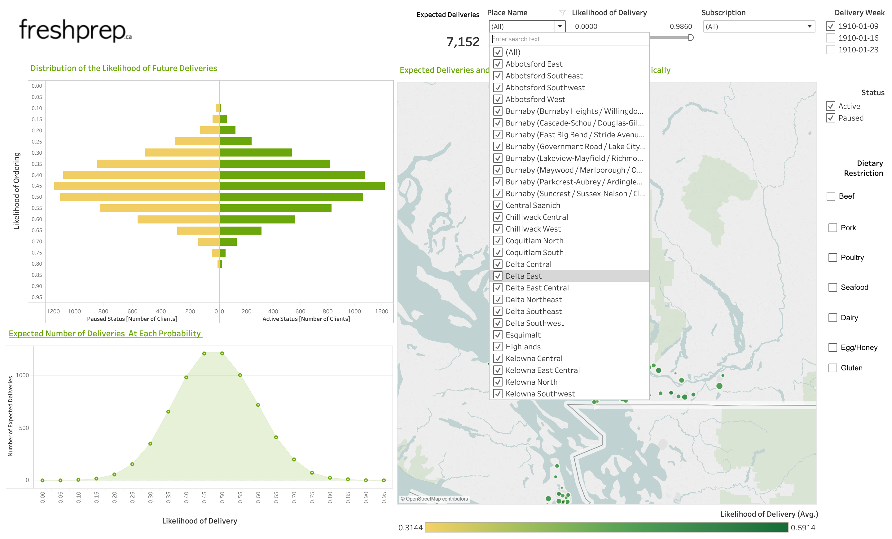

+++
title = "Fresh Prep: Order Predictions"
date = 2019-06-27
draft = false

Tags = ["current"]

#Example: tags = ["machine-learning", "deep-learning"]
#Project summary to display on homepage.

summary = "Predicting future orders for Fresh Prep a Vancouver Local Meal Delivery Company "

#Slides (optional).
#Associate this page with Markdown slides.
#Simply enter your slide deck's filename without extension.
#E.g. slides = "example-slides" references
#content/slides/example-slides.md.
#Otherwise, set slides = "".
slides = ""

#Optional external URL for project (replaces project detail page).
external_link = ""

#Links (optional).

#url_pdf = "" url_code = "" url_dataset = "" url_slides = "" url_video = "" url_poster = ""

url_video = "https://drive.google.com/file/d/1SMXQXHZKUIhUgyqobPEwAn9cb6Mk7lfD/view?usp=sharing"

#Custom links (optional).

#Uncomment line below to enable. For multiple links, use the form [{...}, {...}, {...}].
#url_custom = [{icon_pack = "fab", icon="twitter", name="Follow", url = "https://twitter.com"}]

#Featured image
#To use, add an image named featured.jpg/png to your page's folder.

[image]

#Caption (optional)
caption = "To protect the privacy of the company, all data used in the Dashboard images are fabricated"

#Focal point (optional)
#Options: Smart, Center, TopLeft, Top, TopRight, Left, Right, BottomLeft, Bottom, BottomRight

focal_point = "Center"
+++

 **Summary:**    
Fresh Prep, a local meal kit delivery company, has been striving to help their busy clientele cook quick, healthy dinners. The business model consists of delivering high-quality ingredients and recipes to cook meals in under 30 minutes each week. Ingredients come pre-chopped and pre-portioned for faster cooking. This project explored Fresh Prep's data in an attempt to predict the weekly number of orders. Our team built a model that predicts a probability of ordering for each client, from features that were all engineered and calculated. 

 **Nomenclature and Specifics:**    

Fresh Prep orders can be either:  

-  **Skipped**   - an order that does not get delivered or charged, or    
-  **Billed**  - an order which will be delivered and charged to the client.       

From there, a specific customer can choose to set their status to either of the following:  

-  **Active**  - orders are automatically billed each week or    
-  **Paused**  - orders are automatically skipped each week    

  
<strong> Fig 1: Examples of billed (left) and skipped (right) orders </strong>

 **Goal:**     

Our analysis focused around which active clients would be taking an action of opting out of particular orders and paused clients opting in for future orders. 
The question we were attempting to answer for Fresh Prep was approximately: **How many orders can the company expect in upcoming weeks?**   
In order to give a better estimate to this question, our analysis was concentrated on answering instead: **Which customers will be ordering in the upcoming weeks?**
This enabled Fresh Prep to:

* Target specific clients to improve future order rates
* Improve marketing, production, and financial strategies
* Avoid sending unnecessary emails to clients who have a larger chance of ordering or not ordering at all

 **Procedure:**  

1. **Data Wrangling:**  
  During the course of this project, we were lucky to have a substantial amount of data and Relational Databases to conduct our analysis. Fresh Prep stored their data using PostgreSQL. To create a model to predict order probabilities we had to engineer all our features and wrangle the data into a single clean `CSV`. We used R to do our wrangling instead of SQL for the convenience of conducting concurrent Exploratory Data Analysis. 

2. **Exploratory Data Analysis (EDA):**  
  Through the process of EDA, the team was able to make quite a number of valuable insights into the business: 

  * We found **active** and **paused** customers behave in quite different manners. The order rates of the two customer types were significantly dissimilar
  * The ratio of billed to skipped orders for the active customers were relatively equal making the dataset quite balanced for predicting on our model. This made it obvious to us to have two different models for active and paused customers
  * Customers tend to order in a similar way of previous weeks
  * The number of dietary restrictions has an effect on the billed order rate; customers with more restrictions, order more often than those with less
  * Customers who are customizing their orders skipping their orders more often than customers who customize less
  * Active customers skip their future orders further out from the delivery date than paused customers who opt-in and bill their orders    
 space  

3. **Feature Engineering:**  
  While wrangling our data, the majority of the features used in the predictive model were engineered. We found these were the most meaningful when predicting orders: 
  * The behaviour of the clients up to 5 weeks before the predictive week
  * The individuals billed order rate up to the given predicted order. This rate was smoothed using an estimation approach known as [Empirical Bayes](http://varianceexplained.org/r/empirical_bayes_baseball/) to account for customers with less history 
  * Unfortunately, due to certain restrictions, we were unable to decompose our data into seasonality and trend components. Instead, we assumed that the trend of orders rates remained constant. We then used the weekly billed order rate of the particular week of the previous year as a feature
  * The number of weeks a client existed at the time of the predicted order
  * The month the customer joined 
  * A customer’s subscription prices
  * The location of a client's delivery (Latitude and Longitude based on the neighbourhood)
  * A Boolean of whether a customer had `beef` as a dietary restriction   
 space  

4. **Predictive Model:**  
  We Experimented with two models: **Random Forest** and **Logistic Regression**. We split our data into training and testing datasets by training on past order and testing on future ones.  One of the values the company had was the interpretability of it which Logistic Regression provided for us in our final model. As stated earlier, we used two separate models for **paused** and **active** clients. We were worried initially with the unbalanced nature of the dataset for paused clients, however, in this particular case, it was not an issue. For our active clients, we produced a probability of a client billing their order and took an expected value of the number of orders to expect for that week. In comparison, for our paused clients we produced a classification on if they would bill or skip their order based on a 50% threshold. Any paused client with a probability <0.5 would be given a value of 0 ~ a `skipped` order and if the probability was > 0.5, the client would be given a value of 1 for a `billed` order. Summing up these values gave a prediction for the number of billed orders among **paused** clients. 

 **Results:**  

The predictive model that we constructed ended up with a 4.61 Mean Absolute Percentage Error (MAPE) on the total number of billed orders from June 2018 to June 2019. 
To put this into perspective - for a week in the company predicts 1000 orders, the error is at most 50 orders. 
Using only dates in 2019 to give the model more training data.   
If we focus on dates only in 2019 the models have a 1.5% error - this means for a week in which our model predicts 1000 orders, the error is at most 20 orders.

 **Data Product:**  

The product that was delivered to the partner was a reproducible pipeline that includes scripts that creates clean data and runs a predictive model that produces order probabilities per customer.
The pipeline is containerized using Docker and uses a Makefile command to run. The docker image was also made available to the company via **Docker Hub**. 

Once the `CSVs` are created with the scripts, they can be transferred to a **Tableau** dashboard. 
The dashboard we developed visualizes past orders and the model predictions. 

  
<strong> Fig 3: Predictive dashboard page showing hover by location  </strong>

  
<strong> Fig 4: Predictive dashboard page showing hover by probability </strong>

  

  
<strong> Fig 5:Descriptive dashboard page showing filtering by location </strong>

  
<strong> Fig 6: Predictive dashboard page showing hover by expected orders </strong>

  
<strong> Fig 7: Descriptive dashboard page showing hover by location  </strong>

  
  

  
<strong> Fig 8: Descriptive dashboard page showing hover by week in history  </strong>

 **Possible Improvements:**      

Because time was a constraint for this project, we identified improvements to enhance our analysis:

* Running the models only on the undecided groups, and add their expected values to the numbers of the decided groups (opt-in for paused and opt-out for active)
* Account for holiday weeks which tend to contribute to lower order numbers
* Explore further the effects of other features such as recipes and customizations 

---

 **End Notes / TLDR:**      

* Created a predictive model for a meal kit delivery company in Vancouver
* Provided the company with valuable insights about the business
* Constructed predictive models for clients that produced probabilities of billing their next order
* The model predicted orders for dates in 2019 with 1.5% error 
* An interactive Tableau Dashboard was designed and delivered along with a Dockerized image for a reproducible pipeline
* Further improvements can be made  

---

 **_Additional Remarks:_**   
 
This was a capstone project worked in collaboration with: 

* [Orphelia Ellogne](https://www.linkedin.com/in/amah-orphelia-ellogne-a51b11a3/)
* [Maninder Kholi](https://www.linkedin.com/in/manikohli/)
* [Rachel K. Riggs](https://www.linkedin.com/in/rachel-k-riggs/)

Under the supervision of [Michael Gelbart](https://www.mikegelbart.com) 
   
